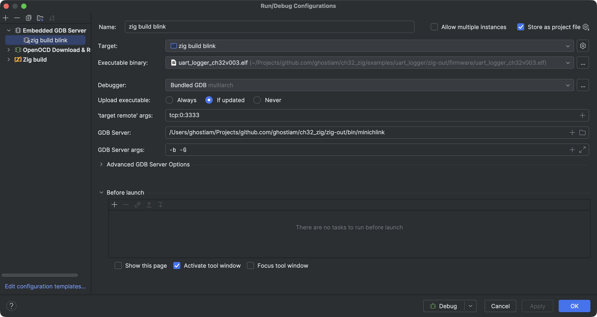
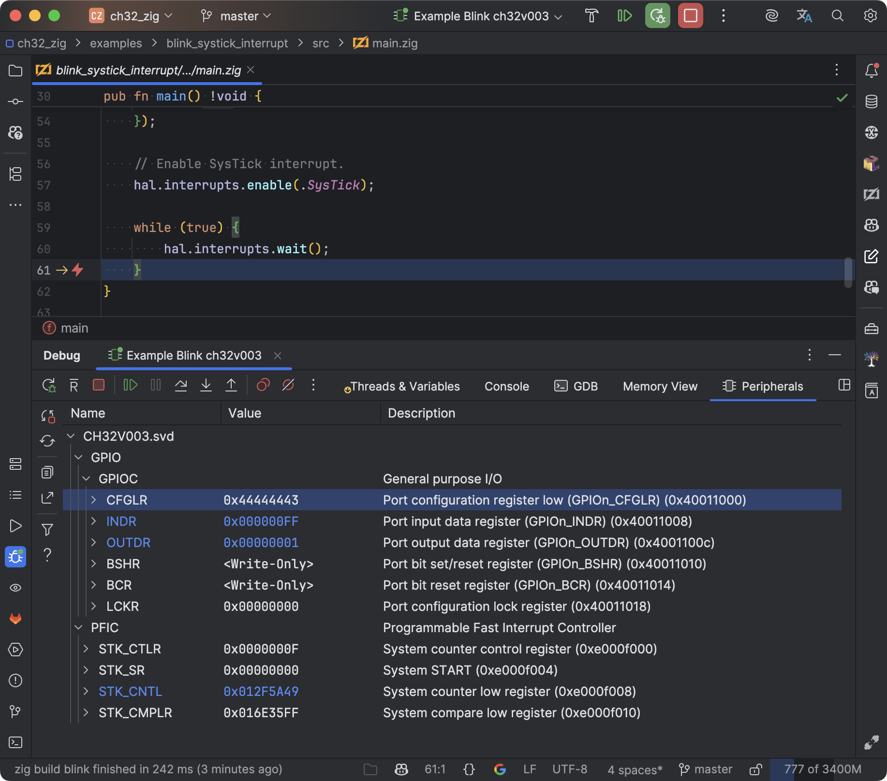
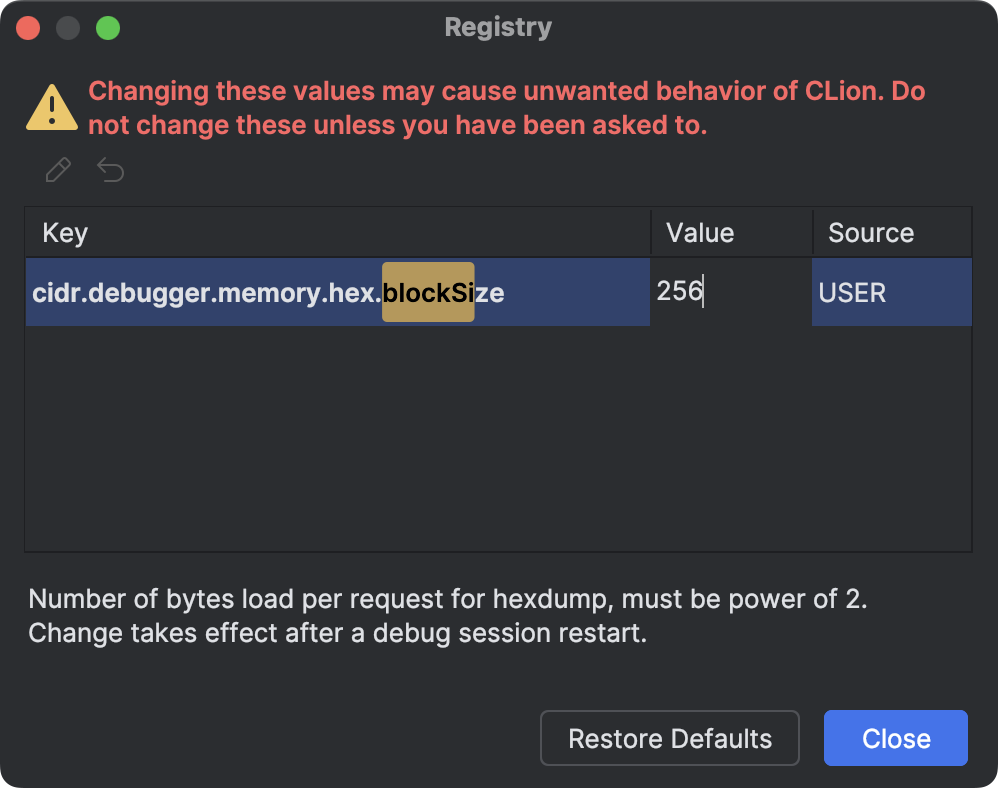

# Useful Notes

## Flashing

```shell
# Write and reboot.
minichlink -w zig-out/firmware/blink_minimal_ch32v003.bin flash -b
```

## Debugging

### Using minichlink with GDB

```shell
# Start the GDB server.
minichlink -G
# Reboot into halt and run GDB server 
# (firmware will be halted until GDB is connected).
minichlink -a -G
# Connect to GDB server.
riscv-none-elf-gdb <path_to_elf>
> target remote 0:3333
```

### Using minichlink in CLion

1. In `Run/Debug Configurations`, add a new `Embedded GDB Server` configuration.
2. Create a `Target` (if not created yet) by clicking on the gear icon
   and [add an empty target](.assets/clion_target_configuration.png) (or configure it properly), then select it in the
   configuration.
3. Set the:
    - `Executable binary` to the path of the `elf` file (e.g.,
      `<project_dir>/zig-out/firmware/uart_logger_ch32v003.elf`).
    - `Debugger` to `Bundled GDB (multiarch)`.
    - `'target remote' args:` to `tcp:0:3333`.
    - `GDB Server:` to `<project_dir>/zig-out/bin/minichlink`.
    - `GDB Server args:` to `-b -G`.
4. In `Before launch`, remove the `Build` step if you have not properly configured the build step.
5. Click `Apply` and `OK`.
6. Done.

My configuration looks like this:



It also allows you to debug peripheral devices:



### Fixing the `Memory View` feature in CLion

To make the `Memory View` feature work in CLion, you need to edit a parameter in the IDE:
[more about the issue](https://youtrack.jetbrains.com/issue/CPP-33250/clion-gdb-memory-view-issue-with-large-number-of-bytes-4096-need-gdb-cmd-logging-esp-see-the-trace-of-gdb-that-clion-uses#focus=Comments-27-7900478.0-0)

Press CTRL+SHIFT+A (CMD+SHIFT+A) -> Registry... \
Find `cidr.debugger.memory.hex.blockSize` there
(start typing `blockSize`, and the IDE will automatically filter the fields as you type),
and set the value to `256` instead of `4096`.



## Show firmware info

```shell
# Size (clang)
size zig-out/firmware/ch32v003_blink.elf
# Sections info (clang)
objdump -h zig-out/firmware/ch32v003_blink.elf 
bloaty zig-out/firmware/ch32v003_blink.elf
```

## Dump memory

```shell
# To file
minichlink -r memory.bin 0x20000000 2048
# To stdout as hex
minichlink -r + 0x20000000 128
# To stdout as hex without empty lines
minichlink -r + 0x20000000 2048 | grep -v "00 00 00 00 00 00 00 00 00 00 00 00 00 00 00 00"
```

## UART

```shell
screen /dev/tty.usbmodem* 115200 
```

`Ctrl + A`, `Ctrl + \` - Exit screen and terminate all programs in this screen. \
`Ctrl + D`, `D` or `Ctrl + A`, `Ctrl + D` - "minimize" screen and `screen -r` to restore it.

## std.Io.Writer

Using `std.Io.Writer` significantly increases the output file size, try to use `std.Io.Writer` only when necessary.