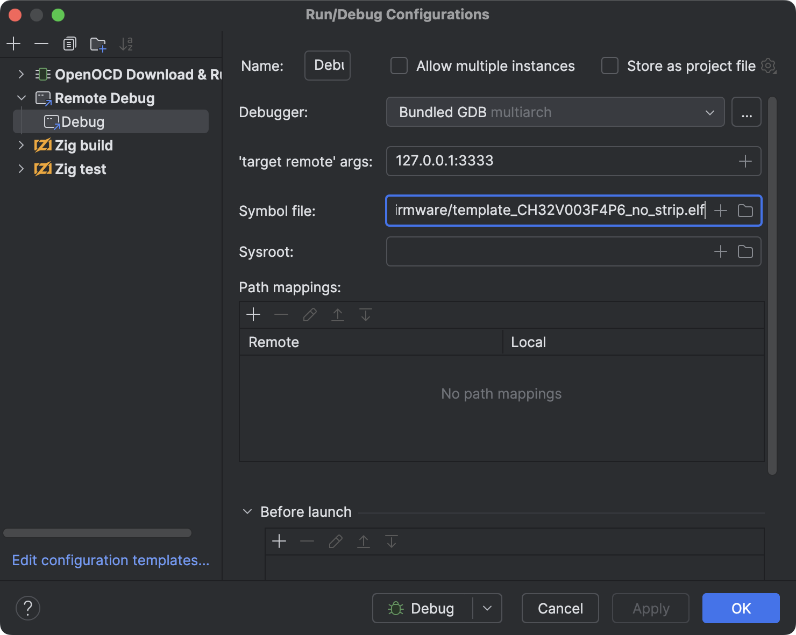
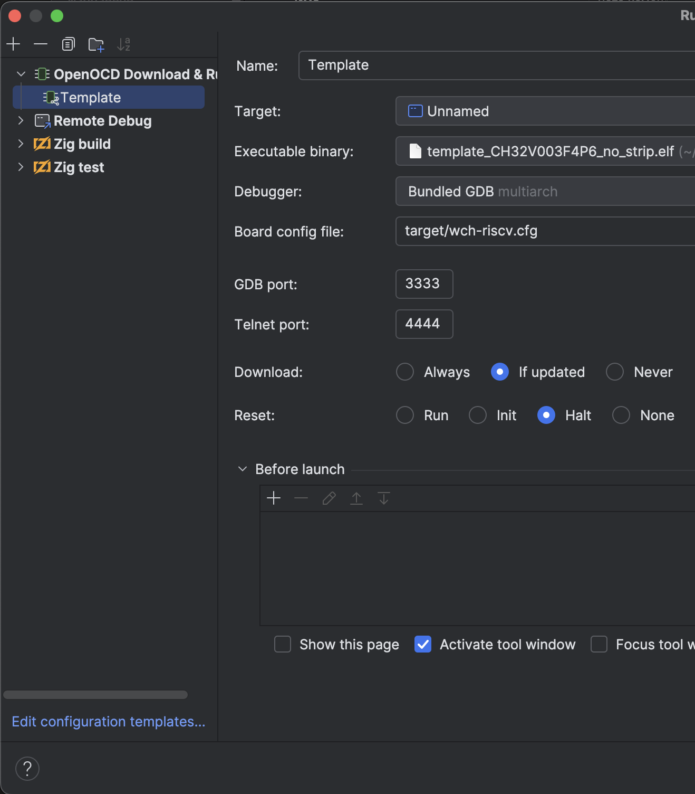

# Useful Notes

## Flashing

```shell
# Write and reboot.
minichlink -w zig-out/firmware/ch32v003_blink.bin flash -b
```

## Debugging

### Using minichlink + GDB or CLion

```shell
# Run GDB server.
minichlink -G
# Reboot into halt and run GDB server 
# (firmware will be halted until GDB is connected).
minichlink -a -G
# Connect to GDB server.
riscv-none-elf-gdb <path_to_elf>
> target remote 0:3333
```

Or in `CLion`: add a new `Remote Debug` configuration.



### Using OpenOCD in CLion

> \[!NOTE\]
> If you are using `nix`, you can run `nix develop .\#idea` in the root of the project, and it will automatically
> configure `CLion` with the `WCH OpenOCD` path.

1. Configure OpenOCD in CLion: Settings -> Build, Execution, Deployment -> Embedded Development -> OpenOCD Location.
2. In `Run/Debug Configurations`, add a new `OpenOCD Download & Run` configuration.
3. Create a `Target` (if not created yet) by clicking on the gear icon
   and [add an empty target](.assets/clion_target_configuration.png) (or configure it properly), then select it in the
   configuration.
4. Set the `Executable binary` to the path of the `elf` file (e.g.,
   `zig-out/firmware/template_CH32V003F4P6_no_strip.elf`).
5. Set the `Debugger` to `Bundled GDB (multiarch)`.
6. Set the `Board config` to `target/wch-riscv.cfg` (the full path to the `wch-riscv.cfg` file is
   `<openocd install dir>/share/openocd/scripts/target/wch-riscv.cfg`).
7. Done.

My configuration looks like this:



## Show firmware info

```shell
# Size (clang)
size zig-out/firmware/ch32v003_blink.elf
# Sections info (clang)
objdump -h zig-out/firmware/ch32v003_blink.elf 
bloaty zig-out/firmware/ch32v003_blink.elf
```

## Dump memory

```shell
# To file
minichlink -r memory.bin 0x20000000 2048
# To stdout as hex
minichlink -r + 0x20000000 128
# To stdout as hex without empty lines
minichlink -r + 0x20000000 2048 | grep -v "00 00 00 00 00 00 00 00 00 00 00 00 00 00 00 00"
```

## UART

```shell
screen /dev/tty.usbmodem* 115200 
```

`Ctrl + A`, `Ctrl + \` - Exit screen and terminate all programs in this screen. \
`Ctrl + D`, `D` or `Ctrl + A`, `Ctrl + D` - "minimize" screen and `screen -r` to restore it.
